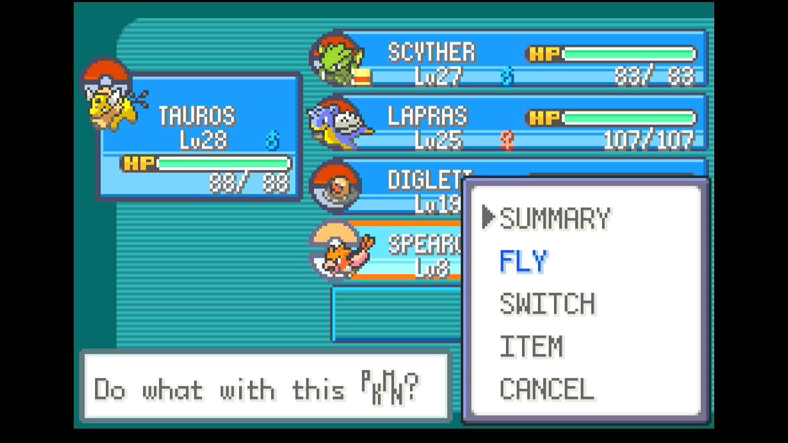

# EV Trainer

## Program Description

Repeatedly defeat wild encounters to EV train your Pokémon.

## Instructions

**Switch Settings:**

1. Screen size: Must be 100% within the Switch settings
2. [Switch 2: All HDR options must be disabled.](../NintendoSwitch/Switch2Notes.md#switch-2-hdr-may-be-problematic)

**Program Settings:**

1. Video Resolution: 1080p or higher

**Game Settings:**

1. Text Speed: Fast
2. Button Mode: Help
3. Frame: Type 1

**Other Setup:**

1. A lead Pokémon that can defeat wild encounters in each relevant location. 
    - HP Training: Caterpie in Viridian Forest (up to Lv. 5)
    - Attack Training: Mankey on Route 22 (up to Lv. 5)
    - Defense Training: Geodude and Onix in Rock Tunnel (up to Lv. 17)
    - Sp. Attack Training: Gastly and Haunter in Pokémon Tower (up to Lv. 20)
    - Sp. Defense Training: Tentacool while surfing (up to Lv. 40)
    - Speed Training: Pidgey and Rattata on Route 1 (up to Lv. 5)
    - Its first move should be a non-ghost, non-ground, non-normal, and non-fighting type damaging move for knocking out normal, flying, and ghost types with Levitate.
2. A Pokémon that knows Fly in the last position of your party.
    - Fly needs to be the first move selectable from POKéMON screen. If this is not the case, use a different Pokémon or forget any other learned HMs via the Move Deleter in Fuchsia City.
    - The Thunderbadge needs to have be obtained before running this program.
    - Fly spots at Viridian City, Pewter City, Vermilion City, Route 10, and Lavender Town need to be unlocked.
3. A Pokémon with Dig in the second-to-last spot of your party.
    - Dig is used for exiting Rock Tunnel and Pokémon Tower, so this is only necessary when training Defense or Sp. Attack EVs.
    - Dig needs to be the first move selectable from POKéMON screen. If this is not the case, use a different Pokémon or forget any other learned HMs via the Move Deleter in Fuchsia City.
4. A Pokémon that knows Surf in your party (at any position).
    - Surf is only necessary for Sp. Defense training.

### Instructions

1. (Optional) Equip your lead Pokémon with a Macho Brace.
    - This doubles all EVs gained from battles. If you do this, make sure you only enter half of the EVs you'd like to earn in this program's options.
2. (Optional) Equip a different Pokémon in your party with an Exp. Share.
    - This allows the second Pokémon to earn EVs in addition to your lead. Note that these EVs are NOT doubled by a Macho Brace held by your lead Pokémon.
3. Start the program from anywhere in Kanto where Teleport or Fly can be used.

## Options

### HP EVs

Set this to the desired number of HP EVs to be earned (0-255).

### Attack EVs

Set this to the desired number of Attack EVs to be earned (0-255).

### Defense EVs

Set this to the desired number of Defense EVs to be earned (0-255).

### Sp. Attack EVs

Set this to the desired number of Sp. Attack EVs to be earned (0-255).

### Sp. Defense EVs

Set this to the desired number of Sp. Defense EVs to be earned (0-255).

### Speed EVs

Set this to the desired number of Speed EVs to be earned (0-255).

### Prevent Pokémon from Evolving ###

If a Pokémon starts to evolve, cancel the evolution. This will happen each time your Pokémon tries to evolve, slowing the program down very slightly. If not checked, the Pokémon will be allowed to evolve. Either way, the program will continue.

### Quit When a New Move is Learned ###

If a Pokémon tries to learn a new move, stop the program. This is useful if you don't want to miss the opportunity to teach your lead Pokémon a particular move. If not checked, the move will not be learned and the program will continue.

### Ignore Shinies ###

If checked, the program will not stop when a shiny is detected, and it will be defeated. Otherwise, the program will stop when a shiny is encountered.

### Take Video ###

Record a video when a shiny Pokémon is found.

### Go Home when Done:

Go to the Switch Home to idle when finished.

## Credits

- **Author:** Astro/Tom

**Discord Server:** 

