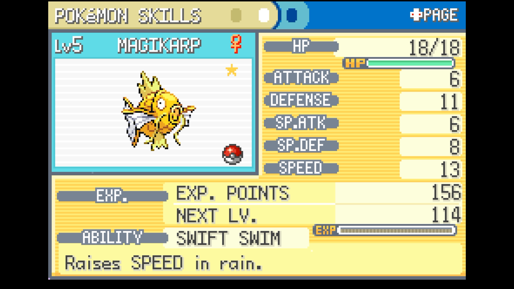

# Gift Reset

## Program Description

Soft reset for a shiny gift Pokemon.

This covers the following:

* Starters (Bulbasaur, Squirtle, Charmander)
* Magikarp from the salesman
* Hitmonlee and Hitmonchan from the Fighting Dojo
* The Celadon Mansion Eevee
* Silph Co. Lapras
* Fossil revivals (Omanyte, Kabuto, Aerodactyl)

*Credit snotyak for the shiny fish*

## Instructions

**Switch Settings:**

1. Screen size: Must be 100% within the Switch settings
2. [Switch 2: All HDR options must be disabled.](../NintendoSwitch/Switch2Notes.md#switch-2-hdr-may-be-problematic)

**Program Settings:**

1. Video Resolution: 1080p or higher

**Game Settings:**

1. Text Speed: Fast
2. Button Mode: Help
3. Frame: Type 1

**Other Setup:**

1. If not resetting for a starter, have exactly 5 Pokemon in your party.
2. Target dependent:
    * Starters, Hitmonlee, Hitmonchan, Eevee: Stand facing the Pokeball containing the desired Pokemon.
    * Magikarp, Lapras: Stand in front of the gift giver. For Magikarp, have enough money to purchase it.
    * Fossils: Give the fossil to the scientist in Cinnabar Lab. Exit and re-enter the room. Then corner the scientist (see image) to prevent them walking away and missing the dialog.
   

### Instructions

1. Follow the setup for the target above.
2. Save the game.
3. Re-open the menu after saving and move the cursor to the top option (POKEDEX for all targets except starters, BAG for starters), then close the menu again.
4. Start the program in-game.

## Options

### Target:

The Pokemon you are hunting.

### Go Home when Done:

Go to the Switch Home to idle when finished.

## Credits

- **Author:** kichithewolf

**Discord Server:** 

