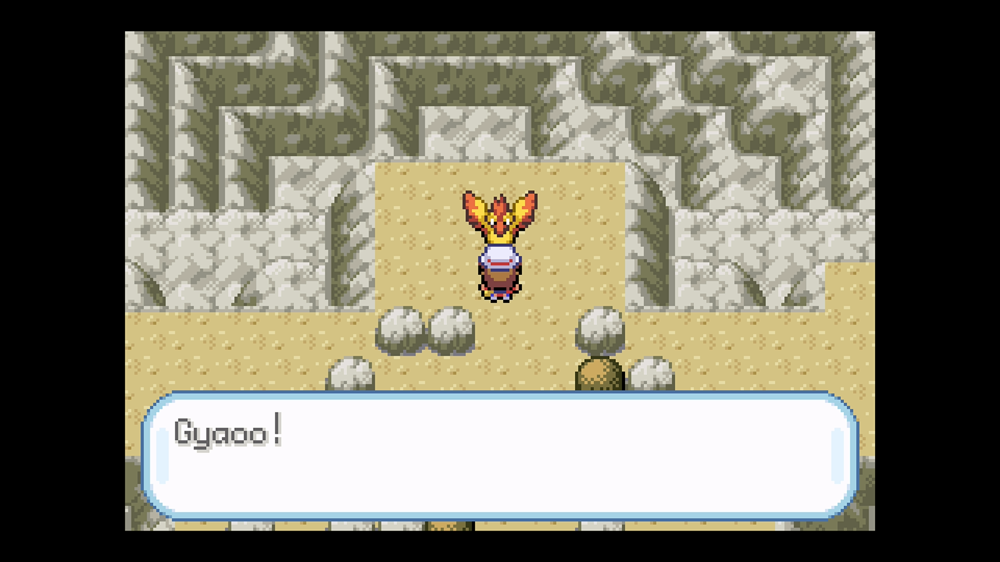

# Legendary Reset

## Program Description

Shiny hunt legendary Pokemon using soft resets.

This program works for:

* Articuno
* Zapdos
* Moltres
* Mewtwo
* Deoxys
* Ho-Oh ([Legendary Run Away](LegendaryRunAway.md) is faster.)
* Lugia ([Legendary Run Away](LegendaryRunAway.md) is faster.)

## Game Settings

1. Text Speed: Fast
2. Battle Scene: Off
3. Frame: Type 1

## Instructions

1. Stand in front of your target and save the game.
    - For Ho-Oh stand one tile before your target. (See below.)
2. Start the program in game.    

## Options

### Walk Up:

Walk up to trigger encounter. Use this for Ho-Oh only.

### Go Home when Done:

Go to the Switch Home to idle when finished.

## Credits

- **Author:** kichithewolf

**Discord Server:** 

