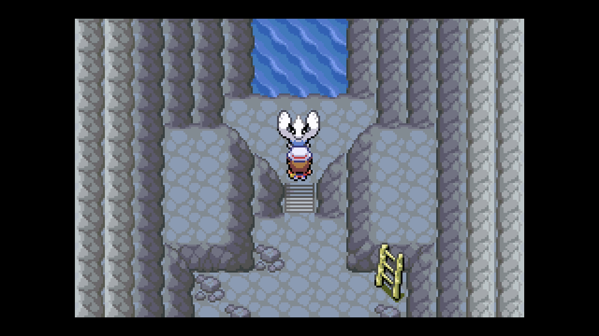
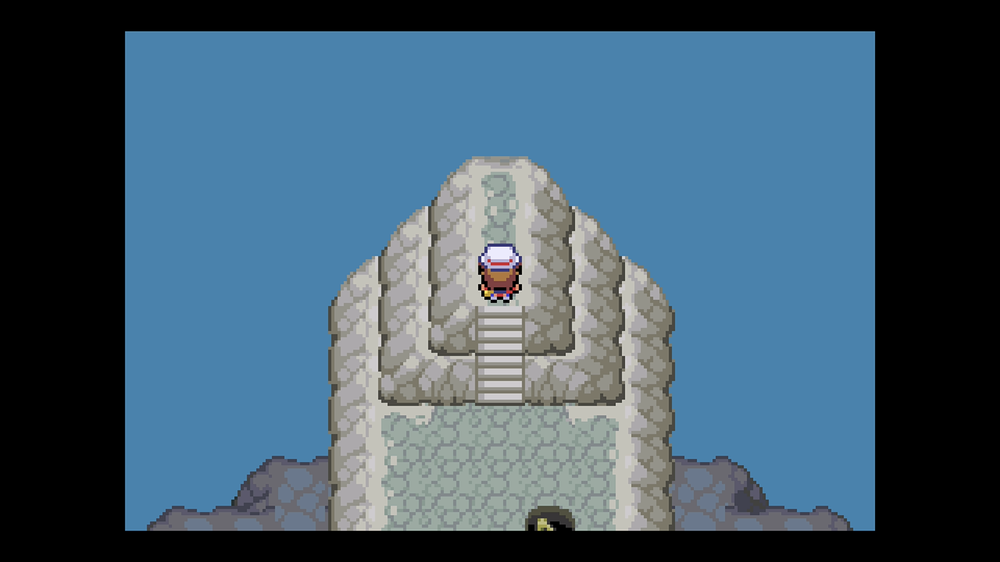

# Legendary Run Away

## Program Description

Shiny hunt legendary Pokemon using the run away method.

This program works for:

* Ho-Oh
* Lugia

## Game Settings

1. Text Speed: Fast
2. Battle Scene: Off
3. Frame: Type 1

## Setup

1. Your lead Pokemon must be faster than your target and/or must have a Smoke Ball. This ensures you can flee successfully.
2. (Optional) For faster resets, your lead does not have any abilities or items that activate on entry.

## Instructions

1. Stand in front of your target.
    - For Ho-Oh stand one tile before your target. (See below.)
2. Start the program in game.    

## Options

### Target:

The legendary Pokemon you are hunting.

### Go Home when Done:

Go to the Switch Home to idle when finished.

## Credits

- **Author:** kichithewolf

**Discord Server:** 

