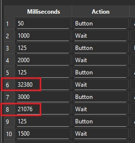

# Macro RNG Manipulation

***The dev team is actively working on a dedicated RNG Manipulation program. As we want to deliver the best possible experience, development and testing take time. In the meantime, we hope this community macro guide helps bridge the gap.***

RNG Manipulation in the Nintendo Switch version of **Pokémon Fire Red & Leaf Green** allows you to control which Pokémon you encounter, including their IVs, nature, and shininess. This guide covers the macro-assisted approach to RNG manipulation, which uses computer-timed button presses for greater precision than doing it by hand.

> **Prerequisites:** Before using this guide you should already be able to:
>
>   - Find your Trainer ID (TID) and Secret ID (SID)
>   - Calibrate your initial seed using EonTimer and Ten Lines
>   - Perform a basic RNG hit by hand
>
> If any of these are unfamiliar, start with the [RNG Manip Guide for Starters](#useful-guides) video below.

---

## Table of Contents

1. [Useful Guides](#useful-guides)
2. [External Tools](#external-tools)
3. [Macro Tools](#macro-tools)
4. [How to Use the Macros](#how-to-use-the-macros)

---

## Useful Guides

**[RNG Manip Guide for Starters](https://www.youtube.com/watch?v=DfO2Zb9i3Bs)** by im a blisy

A complete walkthrough for beginners covering:
- How to find your Secret ID
- How to use EonTimer and Ten Lines together
- How to perform your first RNG hit from scratch

This video is the recommended starting point if you are new to FRLG RNG.

---

## External Tools

**[Ten Lines](https://lincoln-lm.github.io/ten-lines/?page=1)**
Searches for RNG targets, calibrates your initial seed, and provides several other RNG helpers. This is your primary tool for finding spreads and calculating advance counts.

**[EonTimer](https://dasampharos.github.io/EonTimer/)**
A precision timer built for Pokémon RNG manipulation. Used to hit your target initial seed with frame-accurate timing.

**[JS-Finder](https://lincoln-lm.github.io/JS-Finder/Gen3/IDs.html)**
Finds your possible Secret IDs by brute-forcing combinations based on your Trainer ID and known encounters.

**[Decimal to Hexadecimal Converter](https://www.rapidtables.com/convert/number/decimal-to-hex.html)**
Converts decimal seed values to hex for input into other tools. Any converter will work — this is the one used in the starter video above.

---

## Macro Tools

Instead of pressing buttons frame-perfectly by hand, macros let a computer execute the inputs at precise intervals. The macros in this guide are designed for use with **[Pokémon Automation's Turbo Macro](https://pokemonautomation.github.io/Programs/NintendoSwitch/TurboMacro.html)**.

**Requirements:**
- A Nintendo Switch (hardware or compatible setup)
- A microcontroller
- Basic familiarity with the Pokémon Automation setup

For first-time setup, see the **[Getting Started Guide](https://pokemonautomation.github.io/SetupGuide/index.html)**.

It is still possible to perform RNG manipulation entirely by hand using frame-perfect button presses — macros are an optional convenience for greater consistency.

---
## How to Use the Macros

Most macros will require updating timing values specific to your target. You will calculate these using Ten Lines and EonTimer, then enter them into Turbo Macro before running.

**Step 1** - Download the macro.

**Step 2** - Open Turbo Macro in Pokemon Automation

**Step 3** - Click Load Table and select the macro that you downloaded.

**Step 4** - Edit timings for your specific target

**Step 5** - Start the macro.

### Step-by-Step: Prize Corner Example

**Step 1 — Find your target**
Use Ten Lines to search for a spread that meets your criteria (nature, IVs, shininess, etc.). Note the target seed and the frame count.

**Step 2 — Calculate your initial seed timing**
Enter your target seed into EonTimer and calibrate it to your console. This gives you the delay to hold before booting the game.

**Step 3 — Set the target seed (ms) in the macro**
Open Turbo Macro and locate the seed timing field. Enter the millisecond value for your target seed.

**Step 4 — Calculate the Continue Screen timing**
```
Continue Screen timing (ms) = target frame count − 3000
```
The 3000 ms offset accounts for the time spent holding A through the loading screen before control is returned. This value is fixed and does not need to be calibrated.

**Step 5 — Enter the Continue Screen timing in the macro**
Locate the Continue Screen timing field in Turbo Macro and enter the value from Step 4.

**Step 6 — Run the macro**
Start the macro from the Switch home screen or wherever the macro expects to begin. Do not interact with the console while the macro is running.

### Setting Timings in Turbo Macro



*The timing fields highlighted above are specific to Prize Corner Rng these where you enter your seed (ms) and Continue Screen (ms) values. All other fields can be left at their defaults unless specified by a specific macro's instructions.*

---

## Macro Downloads
Macros are usually uploaded to the discord server by our community. You can attempt to find them by searching for "macro". However, storing files in a discord channel is less than ideal.

So for a more permanent location we have opted to store the macros in the forum on [RotomLabs](https://community.rotomlabs.net/t/frlg-macro-discussion/36) 


## Credits

- **Documentation:** dolphincurry/Dalton-V
- **Macros:** The amazing community members of our discord server.

<hr>

**Discord Server:** 

[](https://discord.gg/cQ4gWxN)