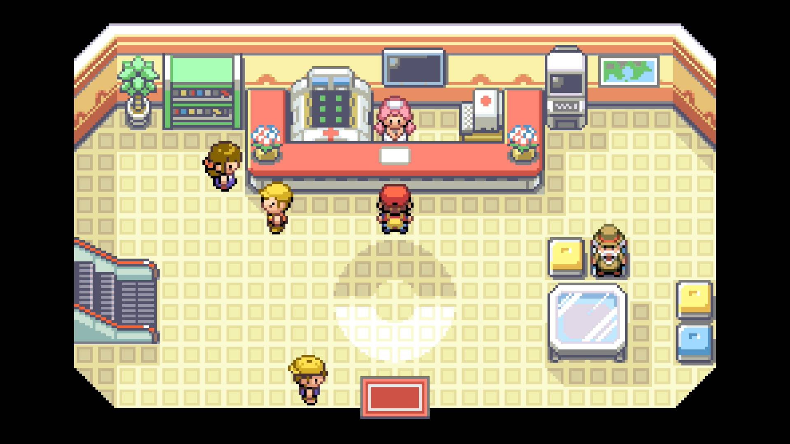
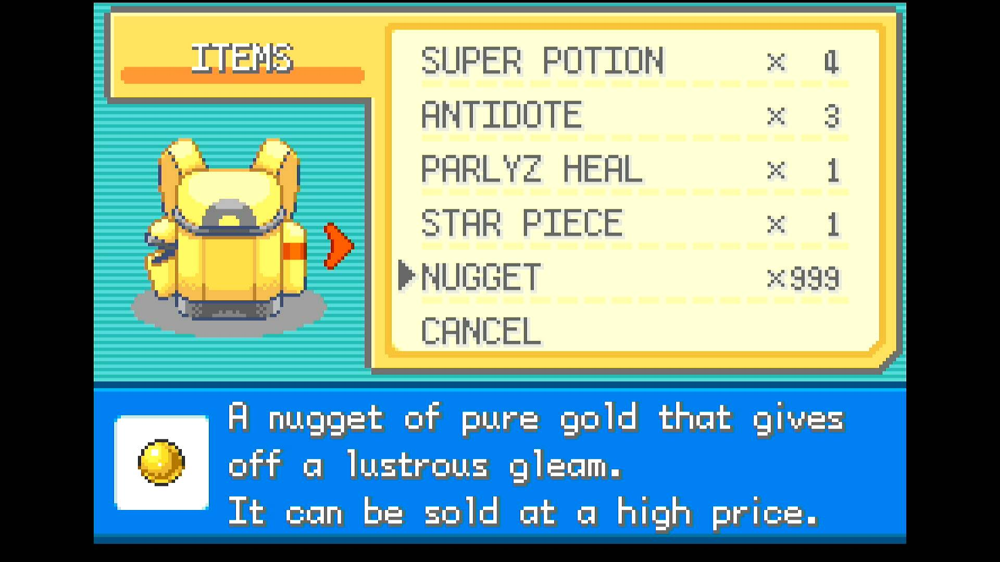

# Legendary Reset

## Program Description

Repeatedly loose the battle against the undercover Team Rocket Grunt at the end of Nugget Bridge to farm nuggets.

## Prerequisites

1. You have **NOT** defeated the Team Rocket Grunt (mystery trainer) at the end of the bridge.
2. You have defeated the your rival.
3. You have defeated the five trainers on the bridge.

## Game Settings

1. Text Speed: Fast
2. Battle Scene: Off
3. Button Mode: Help
4. Frame: Type 1

## Instructions

1. (Optional) Spend all the money you currently have.
    - You will loose [~72 (24 x 3)](https://bulbapedia.bulbagarden.net/wiki/Black_out#Formula_for_money_lost) for each nugget. So you might as well spend what you have prior to starting. 
    - Each nugget is worth 5,000 so it will still be very profitable if you don't spend all of your money. 
2. Enter the Cerulean City Pokemon Center.
3. Use the PC and deposit every Pokemon from your team except one. This should be the lowest level Pokemon you have.
    - We recommend using a level 3 Weedle or Caterpie.
    - This pokemon must be weak enough to loose the fight every time while spamming the first move.
4. Start the program standing in front of Nurse Joy.

## Options

### Number of Nuggets:

Set this to the number of nuggets that you wish to farm. This program gathers ~50 nuggets an hour (when tested on Switch 1).

### Go Home when Done:

Go to the Switch Home to idle when finished.

## Credits

- **Author:** dolphincurry/Dalton-V

**Discord Server:** 

