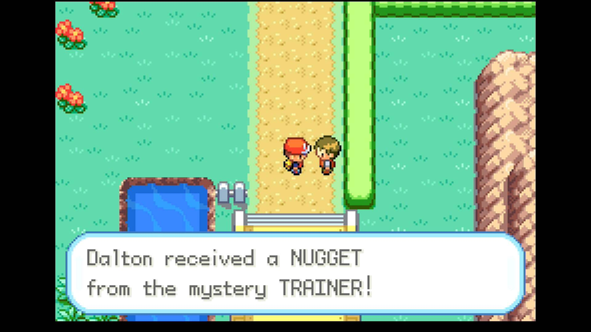
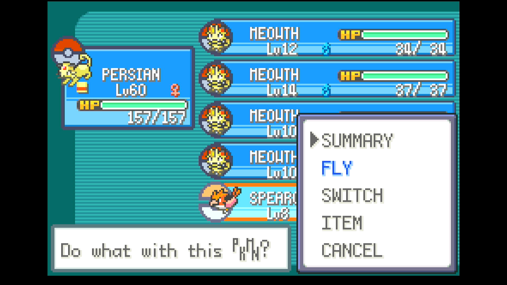

# Nugget Bridge Farmer

## Program Description

Repeatedly defeat low-level wild encounters to farm berries, nuggets, rare candies, PP-UP, and TM10.

## Instructions

**Switch Settings:**

1. Screen size: Must be 100% within the Switch settings
2. [Switch 2: All HDR options must be disabled.](../NintendoSwitch/Switch2Notes.md#switch-2-hdr-may-be-problematic)

**Program Settings:**

1. Video Resolution: 1080p or higher

**Game Settings:**

1. Text Speed: Fast
2. Button Mode: Help
3. Frame: Type 1

**Other Setup:**

1. A lead Pokémon that can defeat wild encounters up to Lv. 5 on Route 1 or Route 22. 
    - Its first move should be a non-ghost, non-ground type damaging move for knocking out Pidgey and Rattata.
    - Meowth or Persian with Pay-Day holding an Amulet Coin is recommended for earning extra money.
2. Four Pokémon with the Pickup ability in positions 2-5 of your party.
    - Meowth has the Pickup ability and can be caught as early as Route 5.
3. A Pokémon that knows Teleport or Fly in the 6th position of your party.
    - This move needs to be the first one selectable from POKéMON screen. If this is not the case, use a different Pokémon or forget any other learned HMs via the Move Deleter in Fuchsia City.
    - If using Fly, the Thunderbadge needs to have be obtained before running this program.

### Instructions

1. (Optional) Remove all held items from your Pickup Pokémon.
    - This prevents the first few battles from being "wasted" by freeing up room for your Pokémon to pick up new items.
2. If using Teleport, visit the Viridian City PokéCenter to set your Teleport location.
3. Start the program from anywhere in Kanto where Teleport or Fly can be used.

## Options

### Game Location

Set this to the desired spot to battle wild Pokémon. The only real difference between Route 1 and Route 22 is the type of EVs earned by your lead Pokémon — exclusively Speed EVs on Route 1 or a combination of Attack and Speed EVs on Route 22. 

### Travel Method:

Set this to Fly or Teleport to match the move known the last member of your party.

### Max Encounters ###

Stop the program after a set number of battles won. Set this to 0 to continue indefinitely.

### Number of Battles Between Item Checks ###

The number of victories to be performed before taking items from your Pickup Pokémon. Pickup grants a 10% chance to find an item after each battle won.

### Prevent Pokémon from Evolving ###

If a Pokémon starts to evolve, cancel the evolution. This will happen each time your Pokémon tries to evolve, slowing the program down very slightly. If not checked, the Pokémon will be allowed to evolve. Either way, the program will continue.

### Quit When a New Move is Learned ###

If a Pokémon tries to learn a new move, stop the program. This is useful if you don't want to miss the opportunity to teach your lead Pokémon a particular move. If not checked, the move will not be learned and the program will continue.

### Ignore Shinies ###

If checked, the program will not stop when a shiny is detected, and it will be defeated. Otherwise, the program will stop when a shiny is encountered.

### Take Video ###

Record a video when a shiny Pokémon is found.

### Go Home when Done:

Go to the Switch Home to idle when finished.

## Credits

- **Author:** Astro/Tom

**Discord Server:** 

