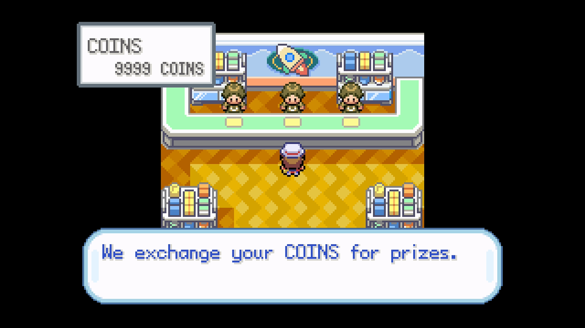

# Prize Corner Reset

## Program Description

Redeem and soft reset for a shiny Game Corner prize.

## Instructions

**Switch Settings:**

1. Screen size: Must be 100% within the Switch settings
2. [Switch 2: All HDR options must be disabled.](../NintendoSwitch/Switch2Notes.md#switch-2-hdr-may-be-problematic)

**Program Settings:**

1. Video Resolution: 1080p or higher

**Game Settings:**

1. Text Speed: Fast
2. Button Mode: Help
3. Frame: Type 1

**Other Setup:**

1. Have 5 Pokemon in your party.
2. Have enought coins to afford your target.

### Instructions

1. Stand in front of the middle window of the Prize Corner.
2. Save the game and move the cursor to the top option (POKEDEX) after.
3. Start the program in-game.

## Options

### Slot:

Position of the prize in the selection dialog.

### Go Home when Done:

Go to the Switch Home to idle when finished.

## Credits

- **Author:** kichithewolf

**Discord Server:** 

