# RNG Helper (in development)

## Program Description

Semi-automate button presses for performing RNG manipulation in FireRed and LeafGreen. This program requires some knowledge of how RNG manipulation is performed as well as external tools to select your target frame and advance.

This program includes options for several RNG targets:

#### Gifts
- Bulbasaur / Squirtle / Charmander (Starters)
- Magikarp (Route 4 Gift)
- Hitmonchan / Hitmonlee (Saffron City Gift)
- Eevee (Celadon City Gift)
- Lapras (Silph Co. Gift)
- Omanyte / Kabuto / Aerodactyl (Fossils)
- Game Corner Prizes
   - Abra
   - Clefairy
   - Scyther / Pinsir
   - Dratini
   - Porygon
- Togepi (Water Labyrinth Gift Egg)

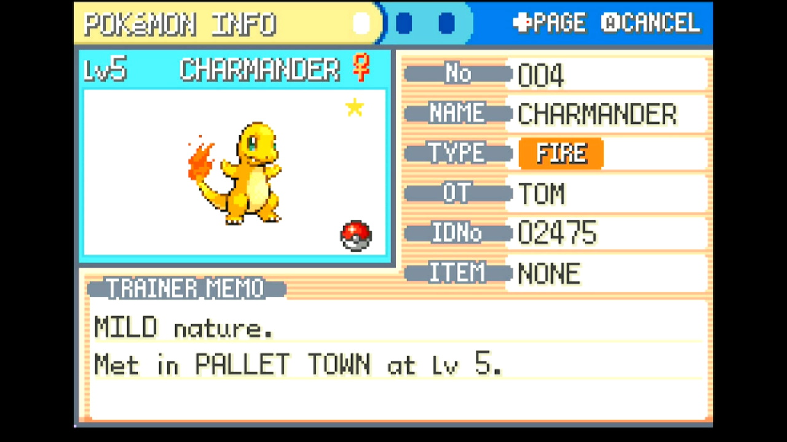

#### Static Encounters
- Electrode (Power Plant)
- Snorlax (Routes 12 and 16)
- Articuno / Zapdos / Moltres
- Mewtwo
- Hypno (Berry Forest)
- Ho-oh (Navel Rock)
- Lugia (Navel Rock)
- Deoxys (Birth Island)

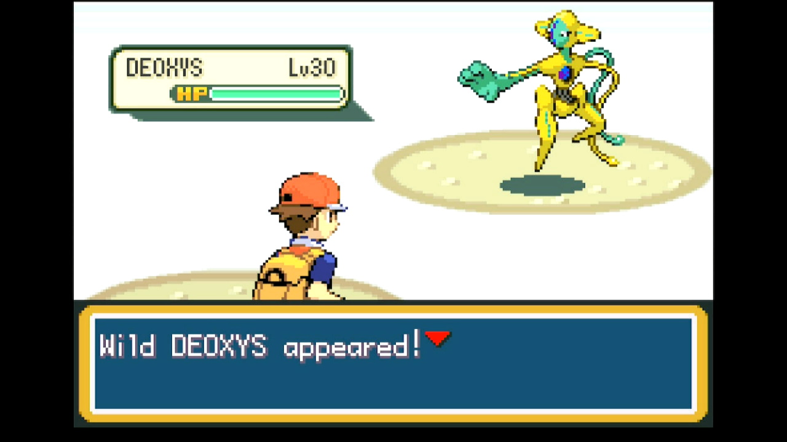

#### Random Encounters
- Sweet Scent (for any location where wild Pokémon spawn when walking or surfing)
- Fishing
- Safari Zone

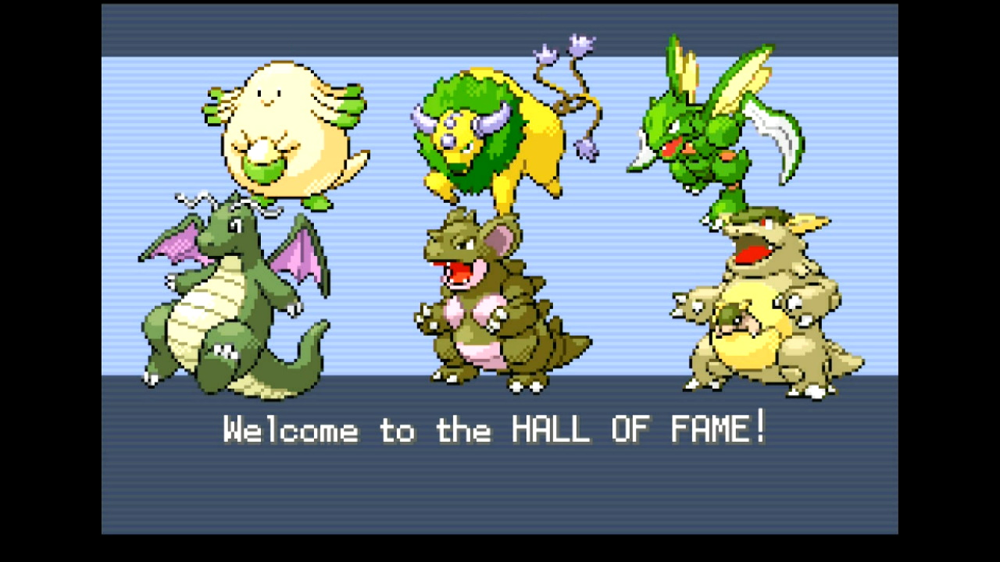

## Instructions

**Switch Settings:**

1. Screen size: Must be 100% within the Switch settings
2. [Switch 2: All HDR options must be disabled.](../NintendoSwitch/Switch2Notes.md#switch-2-hdr-may-be-problematic)

**Program Settings:**

1. Video Resolution: 1080p or higher

**Game Settings:**

1. Text Speed: Fast
2. Button Mode: Help
3. Frame: Type 1
4. Mono / Stereo depending on your target Seed

### Before You Start

- Know your Secret ID and use it to determine your target Seed and Advance.

- Be ready to manually adjust your timings. This program does not perform automatic calibration!

- Come prepared. Ensure you have any necessary Pokémon (e.g. a Sweet Scent user) and items (e.g. a Super Rod, Pokéballs, Max Repel) required by your target

- If fishing, register the rod of your choice to the SELECT button

- If using the Teachy TV, place it at the top of your KEY ITEMS pocket.

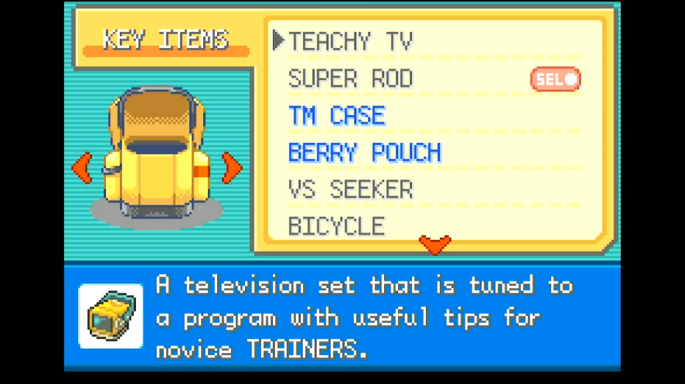

### Instructions

Refer to the following tables for setup instructions for each target:

#### Gifts

For all gifts/prizes, make sure you have a free spot in your party to allow the program to check the Pokémon you obtain.

| Target | Image |
| --- | --- |
| **Starters** - Save facing the Pokéball with your desired starter | --- |
| **Magikarp** - Have at least 500 Pokédollars  - Save facing the Magikarp salesman | [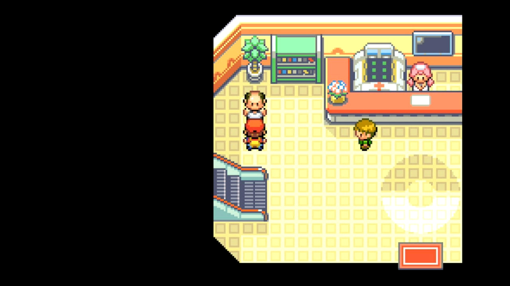](images//RngHelper-magikarp.jpg) |
| **Hitmonchan / Hitmonlee** - Save facing the Pokéball with your desired choice | --- |
| **Eevee** - Save facing Eevee's Pokéball | [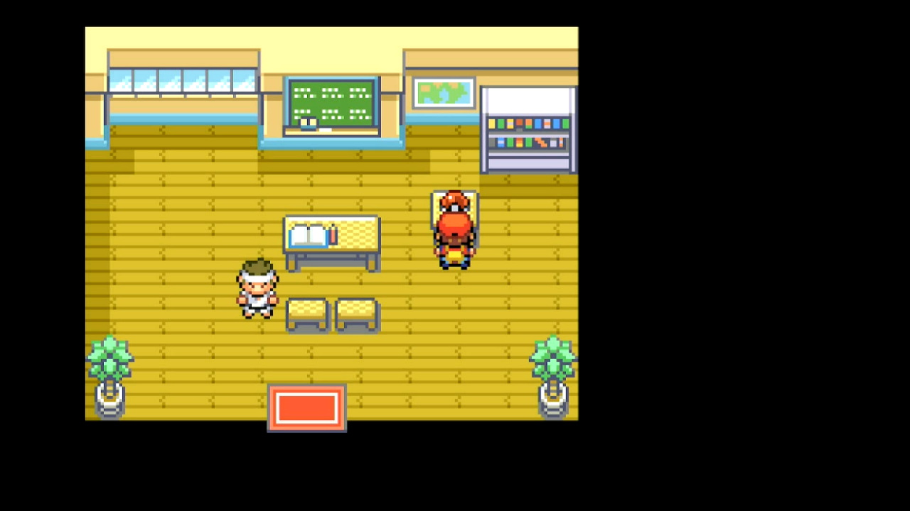](images//RngHelper-eevee.jpg) |
| **Lapras** - Save facing the Silph Co. employee | [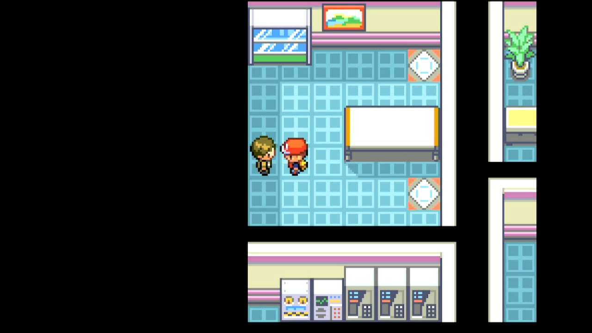](images//RngHelper-lapras.jpg) |
| **Fossils** - Give a fossil to the scientist at the Cinnabar Lab  - Exit and reenter the building  - Save next to the scientist |  |
| **Game Corner Prizes** - Have enough coins to purchase your desired prize  - Save facing the prize counter | [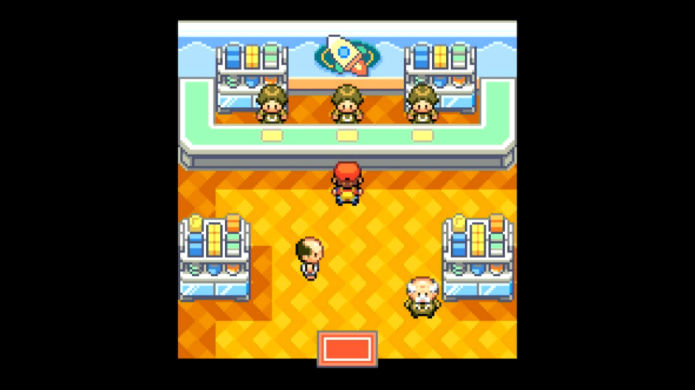](images//RngHelper-gamecorner.jpg) |
| **Togepi** - Set your lead Pokémon to something with maximum Friendship  - Use your bicycle  - Save facing the old man | [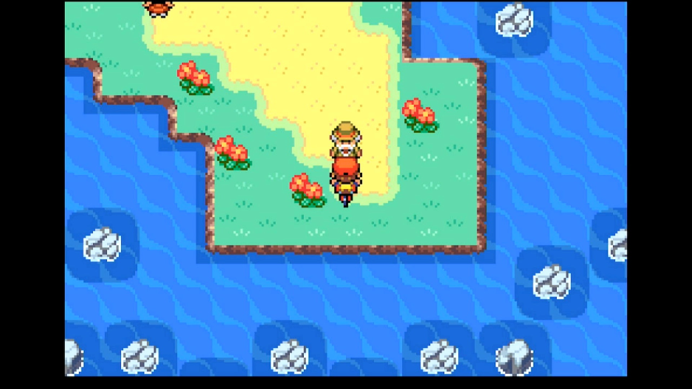](images//RngHelper-togepi.jpg) |

#### Static Encounters

For all static encounters, make sure you have all Pokémon and items you need to succeed in catching your target.

| Target | Image |
| --- | --- |
| **Static Overworld Encounters** - Valid for anything not otherwise listed in this table  - Save facing the Pokémon  - For Deoxys, solve the puzzle on Birth Island and save in front of the red triangle | [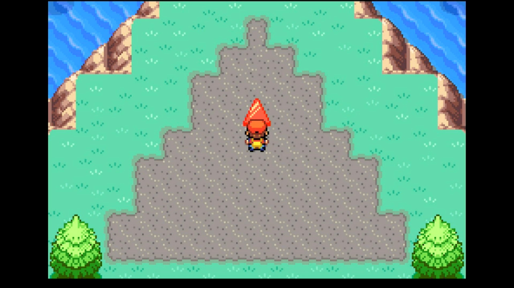](images//RngHelper-deoxys.jpg) |
| **Snorlax** - Obtain the Pokéflute  - Save facing Snorlax | [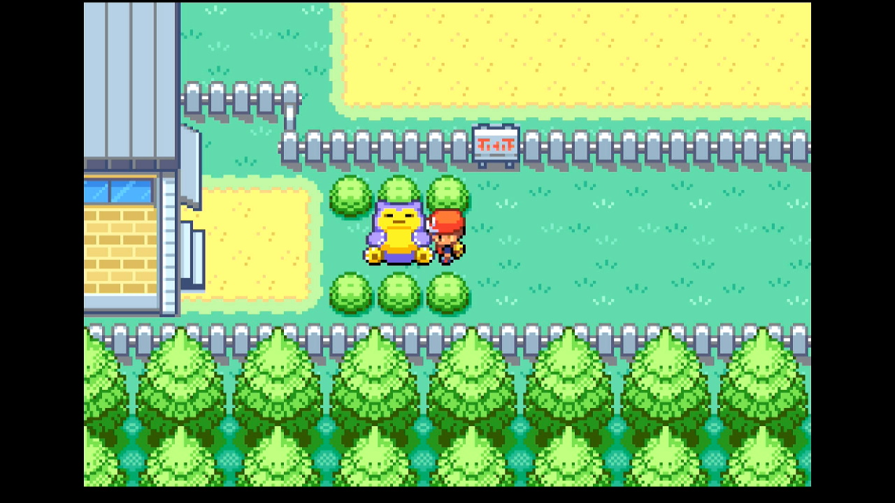](images//RngHelper-snorlax.jpg) |
| **Mewtwo** - Save facing the Mewtwo | --- |
| **Ho-oh** - Save at the top of the steps at the very top of Navel Rock  - The encounter with Ho-oh is triggered after taking another step northward | [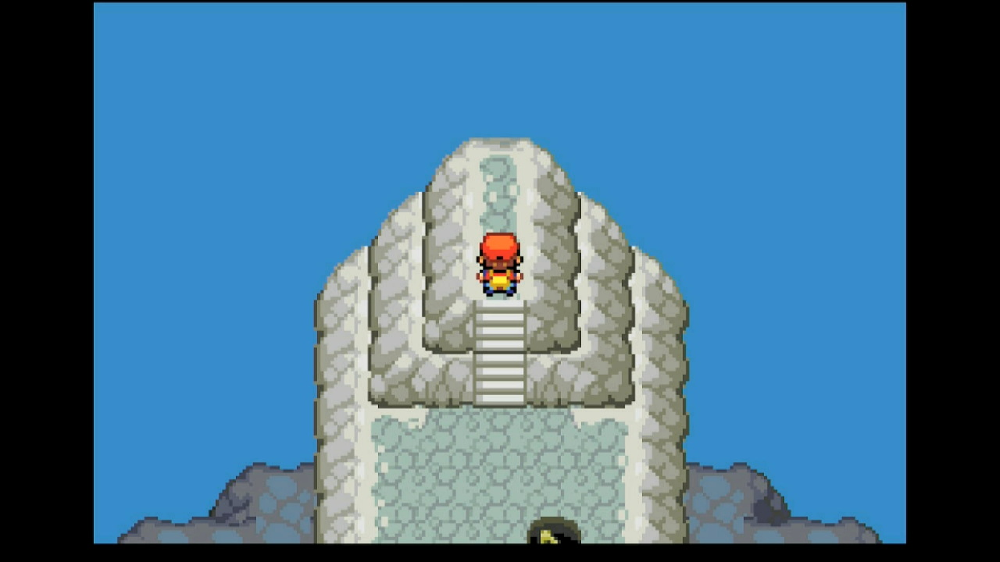](images//RngHelper-hooh.jpg) |
| **Berry Forest Hypno** - Save facing Lostelle in Berry Forest | --- |

#### Random Encounters

For all random encounters, make sure you have all Pokémon and items you need to succeed in catching your target.

| Target | Image |
| --- | --- |
| **Sweet Scent** - Travel to a location where your target spawns (in tall grass, a cave, etc.)  - Move a Pokémon with Sweet Scent to the last occupied slot in your party  - Save the game | --- |
| **Fishing** - Register the fishing rod you'd like to use to the SELECT button  - Travel to the water's edge where your target spawns  - Save the game | --- |
| **Safari Zone** - If fishing, register the rod you'd like to use to the SELECT button  - Have at least 500 Pokédollars  - Stand atop the Pokéball logo on the floor of the Safari Zone entrance  - Use a Max Repel  - Save the game | [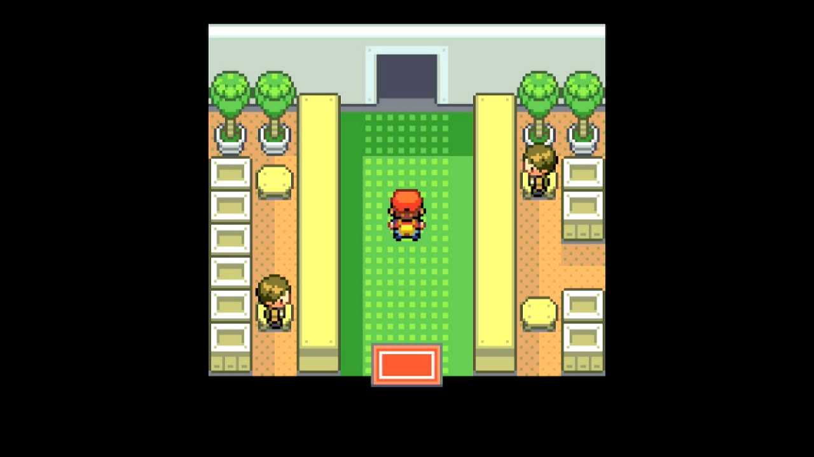](images//RngHelper-safarizone.jpg) |

**For all targets, start the program after saving.**

#### Calibration

After performing the in-game setup for your target, run the program for 1 reset and obtain whatever Pokémon you encounter. Determine how much you missed your seed and advance and adjust their calibration offsets as needed.
Repeat until you hit your target.

There can be a small amount of inconsistency in the program, particularly when it comes to hitting seeds. If you are consistently within ±1 of your seed and advance, it might be a good idea to set Max Resets higher than 1 and let the program loop through several attempts until it hits a shiny.

## Options

### Max Resets:

Set this to the maximum number of resets to attempt. Only use this after you've dialed in your calibrations.

### Seed Delay Time (ms):

Sets the target amount of time to wait between starting the game and pressing A on the title screen. Set this with the help of an external RNG tool.

### Seed Calibration (ms):

This modifies the Seed Delay Time. Set this to offset the program by the amount you've missed your seed.

### Load Screen Advances (frames):

Sets the number of frames to wait between the title screen and loading the game. Your target advance should be equal to this value plus the In-Game Advances. Set this with the help of an external RNG tool.

### Load Screen Calibration (frames):

This modifies the Load Screen Advances. Set this to offset the program by amount you missed your target advance.
If you've missed your advance frame, you can calibrate your timing using either the Load Screen or In-Game advances. Note that In-Game advances can only result in 2 by 2 changes in hit advances.

### In-Game Advances (frames):

Sets the number of frames after loading the game before finalizing an encounter. Your target advance should be equal to this value plus te Load Screen Advances. Set this with the help of an external RNG tool.
Note that frames are passed at double speed after loading the game.
If using the Teachy TV, which advances frames at x313 speed, most of your target advances should be passed in-game. 

### In-Game Calibration (frames):

This modifies the In-Game Advances. Set this to offset the program by amount you missed your target advance.
If you've missed your advance frame, you can calibrate your timing using either the Load Screen or In-Game advances. Note that In-Game advances can only result in 2 by 2 changes in hit advances.

### Detect Copyright Text:

If checked, this starts the seed timer only after the program detects the appearance of the copyright text when the game is started. This can be helpful for improving seed consistency.

### Use Teachy TV:
If checked, the program will open the Teachy TV to quickly advance in-game frames at 313x speed.
*Warning: can result in larger misses before calibration*

### Take Video:

Record a video when a shiny is found.

### Go Home when Done:

Go to the Switch Home to idle when finished.

## Credits

- **Author:** Astro (Tom)

**Discord Server:** 

