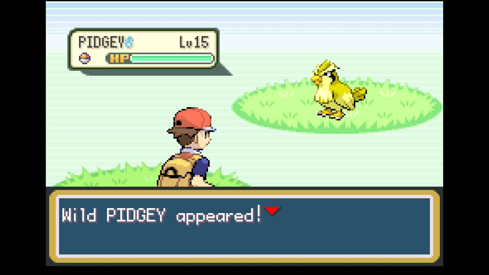

# Shiny Hunt - Overworld (Beta testing - not yet available to the public)

## Program Description

This program will shiny hunt random encounters (grass, cave).

## Game Settings

1. Text Speed: Fast
2. Battle Scene: Off
3. Button Mode: Help
4. Frame: Type 1

## Setup

1. Your lead Pokemon must be faster than your target and/or must have a Smoke Ball. This ensures you can flee successfully.
2. Your lead must not be shiny.
3. (Optional) For faster resets, your lead does not have any abilities or items that activate on entry.

## Instructions

1. Stand in a spot where you can move left/right or up/down forever and not wander off.
2. Make sure you are safe from getting attacked by trainers.
3. Start the program in game. Make sure the device is the connected controller.

## Options

### Maneuver:

How to move around overworld to trigger an encounter.
Pick the one that's most appropriate for your location:

- Move left/right. (no bias)
- Move left/right. (bias left)
- Move left/right. (bias right)
- Move up/down. (no bias)
- Move up/down. (bias up)
- Move up/down. (bias down)

The "bias" will make it travel in that direction a little bit more. So if you're standing against a wall that's unbounded on the other side, you'll want to bias in the direction of the wall to avoid drifting away from it.

### Move Duration:

Travel for this long before changing directions.

### Take Video:

Whether to take a video of the encounter if it is a shiny.

### Go Home when Done:

After finding a shiny, go to the Switch Home to idle. Turn this off for unattended streaming so that your viewers can see the shiny.

## Credits

- **Author:** dolphincurry/Dalton-V

**Discord Server:** 

