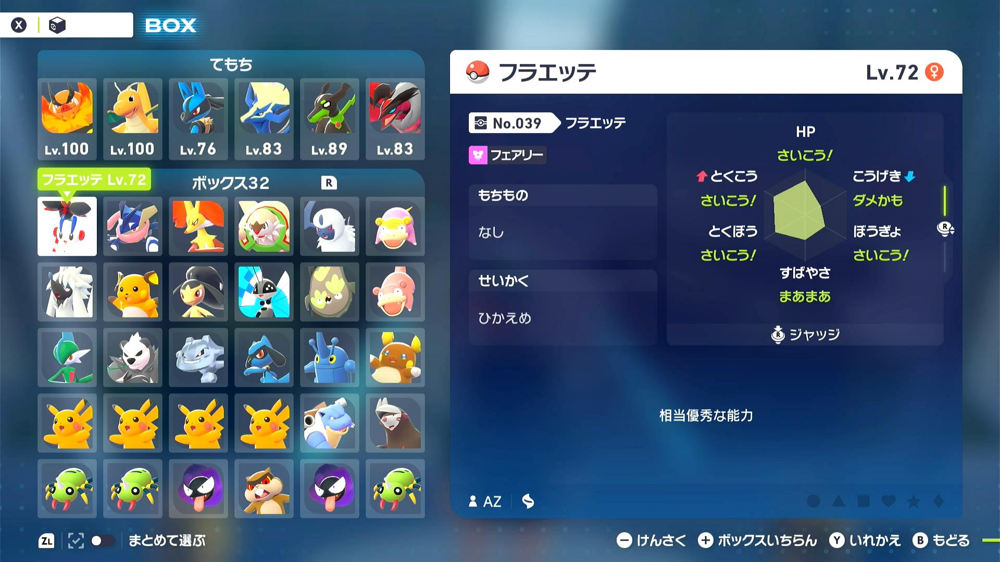
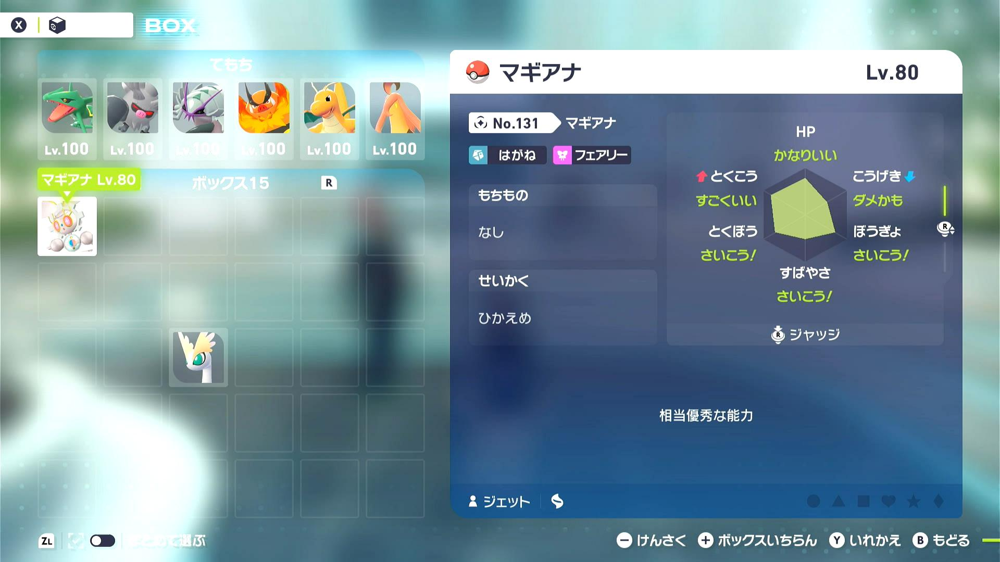
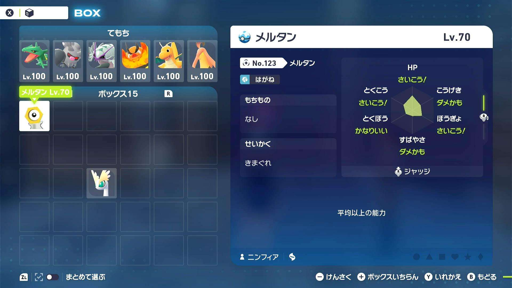
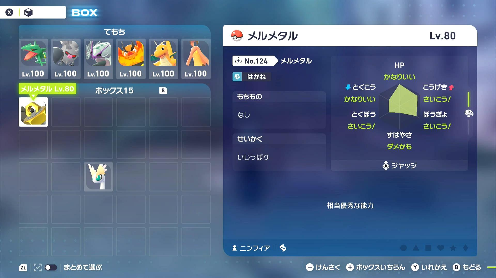
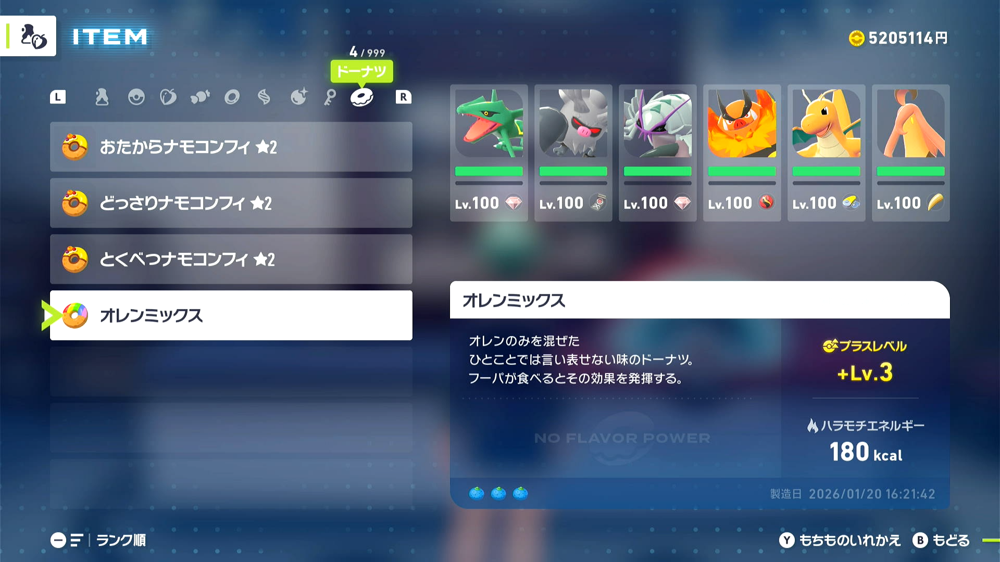

# Stats Reset

## Program Description

Reset gift Pokémon for desired stats.

**Currently Supported Pokémon:**

1. AZ's Floette 
2. Magearna 
3. Meltan 
4. Melmetal 

**DISCLAIMER:** This program utilizes the backup saves to reset for Pokémon stats and often requires long setup, make sure you fully understand what you need to do before starting the program.

### Setup of Settings

**Switch Settings:**

1. Screen size: Must be 100% within the Switch settings
2. [Switch 2: All HDR options must be disabled.](../NintendoSwitch/Switch2Notes.md#switch-2-hdr-may-be-problematic)
3. [Switch 2: The profile you are using must be the 1st (left-most) profile.](../NintendoSwitch/Switch2Notes.md#resetting-a-game-moves-the-cursor-to-the-1st-user-profile)

**Program Settings:**

1. Video Resolution: 1080p or higher
2. The language in the option must match your in-game language.

**Game Settings:**

1. Text Speed: Fast

**Preparation for AZ's Floette:**

1. Have full boxes and party slots, you can verify this if you can no longer throw balls at wild Pokémon. 
2. Proceed with the 15th reward battle against the rival, enter Quasartico Inc. for the first half of the dialog until your rival tries to give you AZ's Floette but can't due to the full box slots. 
3. Set the guide pin to Quasartico Inc. so that opening the map from the main menu (X press then Plus press) placecs the cursor right above the Quasartico Inc. fly spot. 
4. Make room on the top left slot in the box system, make sure that this is where the cursor is when opening the box system from the main menu.
5. Fly to any Pokémon Center and place a new backup save by healing.
6. Start the program in game.

**Preparation for Magearna:**

1. Have the 999 Mega Shards to complete the Side Mission.
2. Set the guide pin to Quasartico Inc. so that opening the map from the main menu (X press then Plus press) placecs the cursor right above the Quasartico Inc. fly spot. (Refer to the image in step 3 of the Floette setup if needed)
3. Make room on the top left slot in the box system, make sure that this is where the cursor is when opening the box system from the main menu.
4. Fly to any Pokémon Center and place a new backup save by healing.
5. Start the program in game.

**Preparation for Meltan:**

1. Having defeated the Meltan at least once to be able to skip most of the initial sequence.
2. Make room on the top left slot in the box system, make sure that this is where the cursor is when opening the box system from the main menu.
3. Have a lead Pokémon that knows a move that can OHKO (such as Earthquake) the Meltan and place that move on the right slot (button A).
4. Set the scrolls to the desired ball for catching in the options.
4. Fly to any Pokémon Center and place a new backup save by healing.
5. Start the program in game. **DISCLAIMER:** While Meltan has a decent catch rate when knocked out you should still expect over half of the catches to fail. The program does not consume balls so with enough patience it is theortically possibly to get the Meltan in a rare ball with the desired IVs.

**Preparation for Melmetal:**

1. Having a burner 0 star donut on the bottom-most slot ready to be consumed (any 3 store berries will do). 
2. Make room on the top left slot in the box system, make sure that this is where the cursor is when opening the box system from the main menu.
3. Fly to any Pokémon Center and place a new backup save by healing.
4. Start the program in game.

### Program Settings

### Go Home when Done:

After finding a match, go to the Switch Home to idle. This is helpful in preventing day/night switch in game after a match.

### Game Language:

Set this to the language of your game. This is **REQUIRED** for text recognition.

### Gift Pokémon:

The Pokémon you are resetting for.

### Pokéball Right-Scrolls (if Pokémon requires catching)

Scoll this many balls to the right. Negative will scroll to the left.
Keep in mind that each time you reset the game, the ball order will be reset to their natural order. Sorting by favorites does not persist across saves!

### Scoll Hold, Scroll Release, Post-Throw Wait (if Pokémon requires catching)

These are timing parameters. You should not need to adjust these.

### Stats:

The desired IV spread for each stat.

## Credits

- **Author:** Nymphea

**Discord Server:** 

